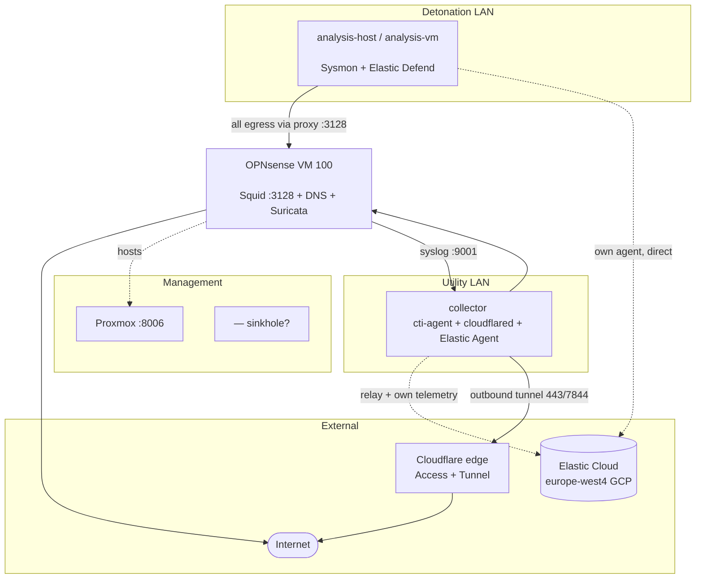

# SagaSecurity / dksec.org Lab — Overview

**Owner:** David Clayton (`dksec.org`)
**Purpose:** malware detonation, detection engineering, and OSINT/CTI workshops
**Documented:** 2026-08-09

> **How to read this pack.** Every fact is tagged:
> **[V]** = verified on the machines on 2026-08-09 · **[T]** = recovered from earlier
> session transcripts on this host · **[?]** = assumption or gap needing your confirmation.
> Nothing tagged **[?]** should be drawn as fact without checking it first.

---

## 1. What the lab is

Three layers that are largely independent of each other:

| Layer | What it does | Where it runs |
|---|---|---|
| **Detonation lab** | Run live malware, capture host + network telemetry | Proxmox VMs behind OPNsense |
| **Telemetry / SIEM** | Ship, store, detect, and investigate | Elastic Cloud (external, GCP) |
| **CTI platform** | Collect + structure open-source threat intel | `cti-agent` stack on collector |

The CTI platform is a **workshop/teaching tool** and is *not* part of the detonation
telemetry path. It reads from the same Elastic Cloud deployment (index
`osinter_articles`) but is otherwise separate. Keep them visually distinct in diagrams.

---

## 2. Physical / virtual inventory

### Proxmox host **[T]**

| Field | Value |
|---|---|
| Management URL | `https://<proxmox-host>:8006` |
| Role | Type-1 hypervisor, hosts all lab VMs |
| Networking | Wi-Fi–backed uplink (`wlp58s0` was the problem NIC; a wired NIC was made primary) **[T]** |

### Guest VMs — **verified via Proxmox API 2026-08-09** **[V]**

Proxmox node `proxmox`: **33.5 GB RAM, 4 CPUs**.

| VMID | Name | Role | RAM | vCPU | State | Bridge(s) |
|---|---|---|---|---|---|---|
| **100** | `OPNSense` | Firewall / router / Squid / DNS / Suricata | 4.6 GB | 1 | running | `vmbr0`, `vmbr1`, `vmbr2` |
| **101** | `analysis-vm` (**`analysis-host`**) | Windows 11 detonation host | 4.3 GB | 2 | running | `vmbr1` |
| **102** | `collector` | Log relay + CTI platform + tunnel | 4.2 GB | 3 | running | `vmbr2` |

*(First draft listed 4.2 / 4.0 / 2.0 GB — all were stale.)*

**VM 101 snapshots [V]** — the clean baseline is **`golden-baseline`**:

| Snapshot | Taken | Note |
|---|---|---|
| `migrated-working` | 2026-07-22 14:40 | migrated from VMware |
| **`golden-baseline`** | 2026-07-22 16:44 | **the clean baseline** |
| `ProxmoxReady` | 2026-08-06 16:31 | first Proxmox snapshot |

`collector` is Debian 13 (trixie), KVM guest **[V]**.

---

## 3. Network segments — **fully verified 2026-08-09** **[V]**

OPNsense (VM 100) is the **only** router. Three **separate physical NICs** — not VLANs
on a trunk — each on its own Proxmox bridge:

| OPNsense NIC | OPNsense label | Address | Bridge | Segment | Purpose |
|---|---|---|---|---|---|
| `em0` | **LAN** | **<firewall-uplink>** | `vmbr0` | `<uplink-subnet>` | **Uplink** to home net; default gw `<home-gateway>` |
| `em1` | **OPT1** | **<firewall-detonation-if>** | `vmbr1` | `<detonation-subnet>` | **Detonation LAN** (dirty) — `analysis-host` |
| `em2` | **OPT2** | **<firewall-mgmt-if>** | `vmbr2` | `<mgmt-subnet>` | **Utility LAN** — collector |

> **`<firewall-uplink>` is OPNsense's own uplink interface**, not a sinkhole. The first draft
> guessed "simulated-internet sinkhole" — wrong. It is the heaviest talker simply
> because all lab traffic NATs out through it.

Also on `<uplink-subnet>`: Proxmox `<proxmox-host>`, upstream gateway `<home-gateway>`.
Docker bridges `172.17–19.0.0/16` are internal to collector.

### Firewall posture — verified from `pfctl` **[V]**

Egress from the **detonation LAN** (`em1`), in rule order:

| Rule | Effect |
|---|---|
| pass → `<firewall-detonation-if>` | firewall itself (DNS, Squid) ✅ |
| pass → `<mgmt-subnet>` | **can reach the utility LAN** ✅ |
| block → `10.0.0.0/8` | **home network blocked** ✅ |
| block → `172.16.0.0/12` | blocked ✅ |
| block → `192.168.0.0/16` | other RFC1918 blocked ✅ |
| pass → `any` | **internet allowed** |

**The detonation LAN is NOT isolated from the internet.** Outbound NAT exists for both
lab segments: `nat on em0 from (em1:network) → (em0:0)` and the same for `em2`. Malware
reaches the real internet; only the home network is walled off — which matches the
stated intent ("make sure the Windows subnet cannot reach my home network").

**No transparent proxy redirect exists.** There are no `rdr` rules for `3128`/`3129`;
`analysis-host` uses an **explicitly configured** proxy plus the Squid CA. Any earlier note
about `80→3128` / `443→3129` redirects does not reflect the running config.

### Previously-open questions — **now answered** **[V]**

| Question | Answer |
|---|---|
| Is `<firewall-mgmt-if>` OPNsense or another router? | **OPNsense `em2` (OPT2)** |
| What is `<firewall-uplink>`? | **OPNsense `em0` (LAN/uplink)** — not a sinkhole |
| Separate interfaces or VLANs? | **Three separate NICs**, one per bridge |
| Which bridge per segment? | `vmbr0`=<uplink-subnet>, `vmbr1`=detonation, `vmbr2`=utility |
| Is the detonation LAN egress-isolated? | **No** — NAT to the internet; only RFC1918/home is blocked |
| Why didn't `analysis-host` answer ping? | VM is **running**; OPNsense permits utility→detonation, so it is almost certainly **Windows Firewall dropping inbound ICMP** (default) |

---

## 4. Diagram brief — network topology

Draw as **three stacked zones**, top to bottom:

1. **External** — Internet, Cloudflare edge, Elastic Cloud (GCP `europe-west4`)
2. **Lab infrastructure** — Proxmox host `<proxmox-host>` and the mgmt network
3. **Lab networks** — dirty `<detonation-subnet>` and utility `<mgmt-subnet>`, separated by OPNsense

Emphasise:
- OPNsense as the **only** router between dirty and utility segments
- `analysis-host` having **no direct internet path** — it egresses via Squid `<firewall-detonation-if>:3128`
- collector's **outbound-only** tunnel to Cloudflare (no inbound ports)
- Telemetry flowing **out** to Elastic Cloud, never inbound

Suggested colours: red = dirty/detonation, amber = utility, green = external managed
services, grey = management.

---

## 5. Companion documents

| File | Contents |
|---|---|
| `01-access-paths.md` | How every human reaches every system, and what authenticates them |
| `02-windows-lab.md` | `analysis-host` detonation host and the sample workflow |
| `03-elastic-logging.md` | Agents, integrations, data streams, ILM, detections |
| `04-cti-agent.md` | The CTI platform stack on collector |
| `05-open-questions.md` | Everything tagged **[?]**, collected for you to answer |
| `06-corrections.md` | Errors in the first draft and the verified reality |
